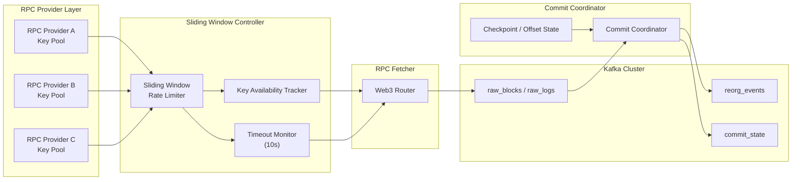
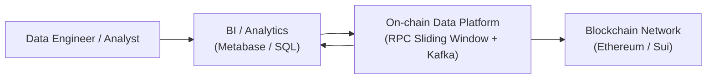

# data-platform-k8s

> **A local, Kubernetes-based Lakehouse platform**  
> A local equivalent implementation of Azure Data Factory + Databricks + ADLS

---

### Architecture



## 1. Project Overview (What & Why)

`data-platform-k8s` is an **end-to-end data platform running on local / private Kubernetes**, designed for:

- Building observable and scalable data pipelines (Batch / Streaming)
- Replicating cloud Lakehouse architecture (Azure / AWS) capabilities locally
- Serving as a **data engineering / platform engineering showcase project**

### Design Goals

- **Decoupling**: Separation of orchestration, computation, storage, and serving
- **Idempotency**: All tasks are repeatable and replayable
- **Engineering Quality**: Not just a demo, but a platform skeleton
- **Extensibility**: Smoothly introduce dbt / Dagster / Iceberg / observability in the future

---

## 2. High-Level Architecture

### system context



```
┌──────────────────────────────────────┐
│            Orchestration             │
│                                      │
│   Airflow (DAG / Schedule / Retry)   │   ← Azure Data Factory
│                                      │
└───────────────┬──────────────────────┘
                │
                ▼
┌──────────────────────────────────────┐
│              Compute                 │
│                                      │
│   Spark Operator / Python Jobs       │   ← Databricks Jobs
│                                      │
└───────────────┬──────────────────────┘
                │
                ▼
┌──────────────────────────────────────┐
│              Storage                 │
│                                      │
│   MinIO (S3 / Bronze-Silver-Gold)    │   ← ADLS / Blob
│   ClickHouse (Analytics Serving)     │
│                                      │
└───────────────┬──────────────────────┘
                │
                ▼
┌──────────────────────────────────────┐
│         Analytics & BI               │
│                                      │
│   Metabase / SQL / API               │   ← Power BI / Synapse
│                                      │
└──────────────────────────────────────┘

Streaming & Tooling:
- Kafka: Real-time data ingestion (Event Hub equivalent)
- Jupyter Notebook: Exploration / validation / analysis (non-production execution)
```

---

## 3. Core Components

### 3.1 Airflow (Orchestration Layer)

**Role**:
- Responsible for **orchestration, scheduling, retries, and dependency management**
- Should not perform heavy computation or implement business logic

**Principles**:
- DAG = workflow definition
- Task = external execution unit (Spark / Python / SQL)

Cloud Equivalent: **Azure Data Factory**

---

### 3.2 Spark (Compute Layer)

**Role**:
- Batch / streaming computation engine
- Main use:
  - Large-scale transformation
  - Aggregation (Silver → Gold)

**Execution**:
- Spark Operator (K8s Native)
- Triggered by Airflow via SparkSubmitOperator

Cloud Equivalent: **Azure Databricks Jobs**

---

### 3.3 Kafka (Streaming Layer)

**Role**:
- Real-time data ingestion
- Decouples producers and consumers

Typical use:
- Blockchain / event streams
- Real-time ingestion

Cloud Equivalent: **Azure Event Hub**

---

### 3.4 MinIO (Data Lake)

**Role**:
- S3-compatible object storage
- Serves as the fact data lake in the Lakehouse

**Data Layers**:

```
minio://lakehouse
├── bronze/   # Raw data (append-only)
├── silver/   # Cleaned / standardized
└── gold/     # Aggregated / metrics
```

Cloud Equivalent: **Azure Data Lake Storage / Blob**

---

### 3.5 ClickHouse (Serving / OLAP)

**Role**:
- High-performance analytical database
- For BI / API / query services

Principles:
- Does not store raw data
- Mainly stores Silver / Gold layer results

---

### 3.6 Metabase (BI & Visualization)

**Role**:
- Data analysis and dashboarding
- For end users / business analysts

Cloud Equivalent: **Power BI**

---

### 3.7 Jupyter Notebook (Analysis Layer)

**Role Definition**:

- ✅ Data exploration
- ✅ Result validation
- ✅ Ad-hoc analysis / visualization
- ❌ Should not be used as bare production execution unit

For automated Notebook execution:
- Only use **Papermill + Airflow**

---

## 4. Execution Patterns

### Pattern A (Recommended): Airflow → Spark Job

```
Airflow DAG
  └── SparkSubmitOperator
        └── PySpark Job
              └── MinIO / ClickHouse
```

Suitable for:
- Production-grade transformation
- Large datasets

---

### Pattern B: Airflow → Papermill → Notebook

```
Airflow DAG
  └── Papermill
        └── Parameterized Notebook
```

Constraints:
- Notebook must be idempotent
- No implicit cell dependencies

---

## 5. Data Engineering Guidelines

### 5.1 Idempotency & Replayability

- All tasks should rely on:
  - Time windows (ds / execution_date)
  - Explicit input paths
- Output paths must be overwritable

---

### 5.2 Exception & Retry Handling

| Exception Type | Meaning | Airflow Behavior |
|----------------|--------|----------------|
| ValueError | Invalid parameters | Fail Fast |
| RuntimeError | Execution failure | Airflow Retry |
| OOM / Crash | Resource issue | Retry / Alert |

---

## 6. Current Components

**Currently Used:**
| Component              | Purpose                                                                 |
|------------------------|-------------------------------------------------------------------------|
| **Airflow**            | ETL/ELT orchestration: task dependency management and pipeline scheduling |
| **Spark**              | Big data processing: batch processing, stream processing, and compute engine |
| **Kafka**              | Real-time messaging: data streaming and event-driven architecture        |
| **MinIO**              | Object storage: S3/ADLS-compatible storage for raw, intermediate, and archived data |
| **ClickHouse**         | Data warehouse: OLAP queries and analytics, optimized for real-time dashboards and large-scale aggregations |
| **Metabase**           | Visualization & BI: reports and dashboards for business users            |
| **Jupyter Notebook**   | Data exploration & experimentation: analysis, visualization, rapid prototyping, and algorithm development |


---
**Planned / Future:**

| Component                | Purpose                    |
|--------------------------|----------------------------|
| **dbt**                  | SQL Transform / Gold Layer |
| **Dagster**              | Asset-Based Pipeline       |
| **Prometheus + Grafana** | Observability              |


---

## 7. Azure Lakehouse Equivalent Mapping

| Azure | data-platform-k8s |
|-------|------------------|
| Data Factory | Airflow |
| Databricks Jobs | Spark Operator |
| Databricks Notebook | Papermill Notebook |
| ADLS / Blob | MinIO |
| Event Hub | Kafka |
| Power BI | Metabase |

---

## 8. Summary

> **A Kubernetes-based local Lakehouse platform equivalent to Azure Data Factory + Databricks + ADLS, designed with production-grade orchestration, compute, and storage separation.**

---

## 9. Future Evolution Roadmap

- Introduce dbt: standardize SQL transforms
- Introduce Dagster: asset visualization and lineage
- Introduce Iceberg / Delta Lake: table-level ACID
- Introduce Prometheus + Grafana: task and resource observability
