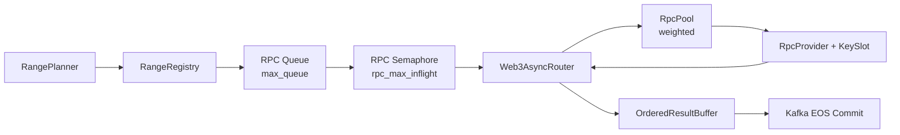

# RPC Scheduling & Rate Control Design

## 1. Overview

This document describes the design of the **RPC scheduling, rate‑limiting, and backpressure system** used in the streaming blockchain ingestion pipeline.

The system is designed to:

* Efficiently utilize heterogeneous RPC providers (public / private, single‑key / multi‑key)
* Respect provider‑specific rate limits
* Maximize throughput while remaining stable under partial failures
* Be **configuration‑driven** (via ConfigMap) and **observable** (via Grafana)

The core idea is to treat RPC providers as **scarce external resources** and manage them using a multi‑dimensional control system.

---

## 2. Design Philosophy

RPC providers differ in:

* Latency
* Reliability
* Rate limits
* Cost
  n
  Therefore, the system avoids strict fairness and instead adopts a **best‑effort, weighted scheduling model** optimized for throughput and stability.

At a high level:

> **Private RPCs are preferred and saturated first; public RPCs act as controlled spillover capacity.**

---

## 3. Three‑Dimensional Rate Control Model

The entire system forms a **three‑dimensional rate‑limiting mechanism**:

> **Time × Concurrency × Window**

### 3.1 Control Dimensions

| Dimension   | Mechanism             | Scope                         |
| ----------- | --------------------- | ----------------------------- |
| Time        | `key_interval`        | Per (RPC provider + API key)  |
| Concurrency | `rpc_max_inflight`    | Global RPC layer              |
| Window      | `max_inflight_ranges` | End‑to‑end ingestion pipeline |

These dimensions work together to prevent overload at different layers.

---

## 4. Core Scheduling Parameters

### 4.1 Provider‑Level Controls

| Parameter      | Responsibility                         | Decision Meaning                                   |
| -------------- | -------------------------------------- | -------------------------------------------------- |
| `weight`       | Generates provider attempt order       | **Resource quota** (who gets inflight slots first) |
| `key_interval` | Enforces provider‑specific rate policy | **Can you send *now*?**                            |

* `weight` controls *priority under contention*
* `key_interval` controls *minimum time gap per key*

Important: **`key_interval` does NOT limit queueing**, only execution timing.

---

### 4.2 System‑Level Controls

| Parameter             | Controls                    | Essence                           |
| --------------------- | --------------------------- | --------------------------------- |
| `rpc_max_inflight`    | Max concurrent RPC requests | **True external concurrency**     |
| `max_queue`           | RPC request buffer size     | **Shock absorber / backpressure** |
| `max_inflight_ranges` | Max unfinished block ranges | **Global sliding window width**   |

---

## 5. Parameter Semantics (Detailed)

### 5.1 `max_inflight_ranges`

* Maximum number of block ranges that can be **submitted but not yet committed**
* Defines the **global ingestion waterline**

```text
Planner  →  [ Range Inflight Window ]  →  Commit
```

**Essence:** System‑level debt capacity

---

### 5.2 `rpc_max_inflight`

* Maximum number of RPC requests allowed to be in flight at the same time
* Implemented via `asyncio.Semaphore`

**Essence:** Real pressure applied to external RPC providers

---

### 5.3 `max_queue`

* Buffer between planner / retry logic and actual RPC execution
* Prevents retry storms and planner bursts from overwhelming the RPC layer

**Essence:** Backpressure & jitter absorption

---

## 6. Recommended Parameter Relationships

To keep the system stable:

```text
max_inflight_ranges ≈ 2 ~ 3 × rpc_max_inflight
max_queue           ≈ 1 ~ 2 × max_inflight_ranges
```

This ensures:

* RPC layer is always saturated but not overwhelmed
* Planner can run ahead safely
* Temporary RPC slowdowns do not cascade upstream

---

## 7. Provider Weight as Resource Allocation

### 7.1 Weight Semantics

`weight` is **not fairness** — it is **capacity allocation**.

In practice:

* Higher weight ⇒ provider appears more often in attempt list
* Under high load, high‑weight providers occupy most inflight slots

```text
Effective RPC Usage ∝ weight × availability × key capacity
```

---

### 7.2 Expected Behavior (Validated via Grafana)

* Providers with `weight = 5` generate significantly more calls than `weight = 1`
* Public RPCs with low weight are used only when private capacity is exhausted

This behavior is **intentional and desired**.

---

## 8. End‑to‑End Scheduling Flow



---

## 9. Why This Design Works

### 9.1 Stability

* Backpressure prevents upstream explosions
* Rate limits are enforced locally per key

### 9.2 Throughput

* Sliding windows keep the system continuously busy
* Weighted scheduling prioritizes high‑quality RPCs

### 9.3 Operability

* All tuning happens via ConfigMap
* Grafana provides immediate feedback
* No code changes required for rebalancing

---

## 10. Operational Strategy

1. **Observe** (Grafana)

   * RPC call count
   * Latency
   * Error rate

2. **Adjust** (ConfigMap)

   * Increase weight for stable private RPCs
   * Reduce or disable unreliable public RPCs

3. **Validate**

   * Check inflight saturation
   * Ensure queue does not grow unbounded

---

## 11. Summary

This RPC scheduling system treats RPC providers as a managed resource pool governed by:
* **Resource quota** (`weight`)
* **Time constraints** (`key_interval`)
* **Concurrency limits** (`rpc_max_inflight`)
* **Pipeline windowing** (`max_inflight_ranges`)

Together, they form a robust, observable, and tunable ingestion backbone suitable for large‑scale blockchain data pipelines.

---

**End of Document**
