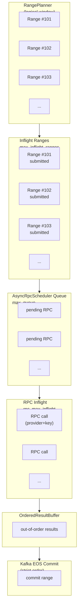

# Relation

```mermaid
flowchart TD
    subgraph P["RangePlanner<br/>(logical window)"]
        A1["Range #101"]
        A2["Range #102"]
        A3["Range #103"]
        A4["..."]
    end

    subgraph I["Inflight Ranges<br/>max_inflight_ranges"]
        B1["Range #101<br/>submitted"]
        B2["Range #102<br/>submitted"]
        B3["Range #103<br/>submitted"]
        B4["..."]
    end

    subgraph Q["AsyncRpcScheduler Queue<br/>max_queue"]
        C1["pending RPC"]
        C2["pending RPC"]
        C3["..."]
    end

    subgraph R["RPC Inflight<br/>rpc_max_inflight"]
        D1["RPC call<br/>(provider+key)"]
        D2["RPC call"]
        D3["..."]
    end

    subgraph O["OrderedResultBuffer"]
        E1["out-of-order results"]
    end

    subgraph K["Kafka EOS Commit<br/>(strict order)"]
        F1["commit range"]
    end

    P --> I
    I --> Q
    Q --> R
    R --> O
    O --> K
```