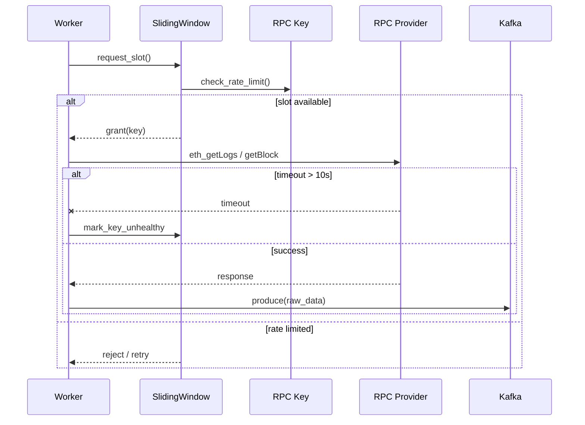

```mermaid
sequenceDiagram
    participant Worker
    participant Window as SlidingWindow
    participant Key as RPC Key
    participant RPC as RPC Provider
    participant Kafka

    Worker->>Window: request_slot()
    Window->>Key: check_rate_limit()
    alt slot available
        Window-->>Worker: grant(key)
        Worker->>RPC: eth_getLogs / getBlock
        alt timeout > 10s
            RPC--x Worker: timeout
            Worker->>Window: mark_key_unhealthy
        else success
            RPC-->>Worker: response
            Worker->>Kafka: produce(raw_data)
        end
    else rate limited
        Window-->>Worker: reject / retry
    end
```