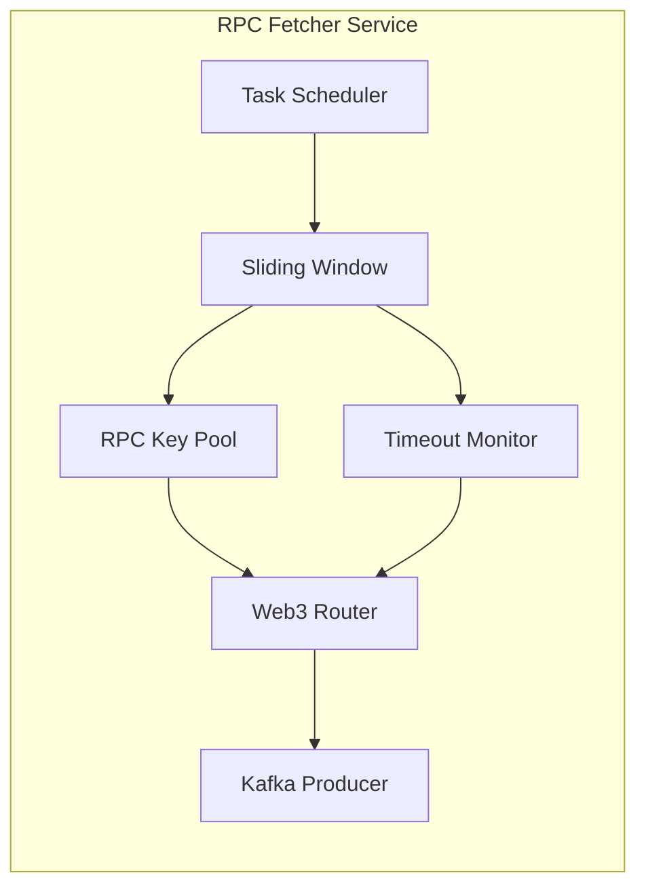

```mermaid
flowchart LR
    subgraph Fetcher["RPC Fetcher Service"]
        Scheduler["Task Scheduler"]
        Window["Sliding Window"]
        KeyPool["RPC Key Pool"]
        Timeout["Timeout Monitor"]
        Router["Web3 Router"]
        Producer["Kafka Producer"]
    end

    Scheduler --> Window
    Window --> KeyPool
    Window --> Timeout
    KeyPool --> Router
    Timeout --> Router
    Router --> Producer
```