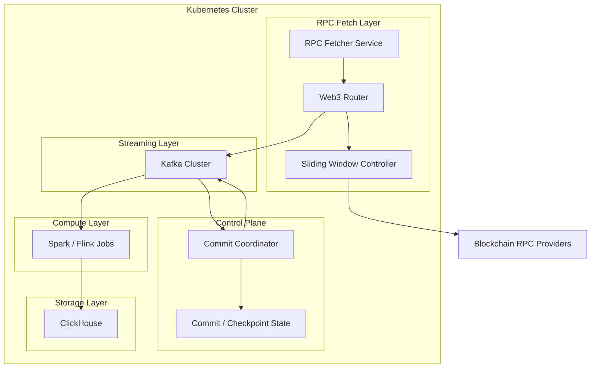

```mermaid
flowchart TB
    subgraph K8s["Kubernetes Cluster"]
        subgraph Fetch["RPC Fetch Layer"]
            Fetcher["RPC Fetcher Service"]
            Router["Web3 Router"]
            Window["Sliding Window Controller"]
        end

        subgraph Stream["Streaming Layer"]
            Kafka["Kafka Cluster"]
        end

        subgraph Control["Control Plane"]
            CC["Commit Coordinator"]
            State["Commit / Checkpoint State"]
        end

        subgraph Compute["Compute Layer"]
            Spark["Spark / Flink Jobs"]
        end

        subgraph Storage["Storage Layer"]
            OLAP["ClickHouse"]
        end
    end

    Chain["Blockchain RPC Providers"]

    Fetcher --> Router
    Router --> Window
    Window --> Chain

    Router --> Kafka
    Kafka --> CC
    CC --> State
    CC --> Kafka

    Kafka --> Spark
    Spark --> OLAP
```