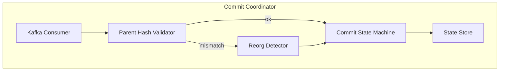

```mermaid
flowchart TD
    subgraph CC["Commit Coordinator"]
        Consumer["Kafka Consumer"]
        Validator["Parent Hash Validator"]
        Reorg["Reorg Detector"]
        FSM["Commit State Machine"]
        Store["State Store"]
    end

    Consumer --> Validator
    Validator -->|ok| FSM
    Validator -->|mismatch| Reorg
    Reorg --> FSM
    FSM --> Store
```