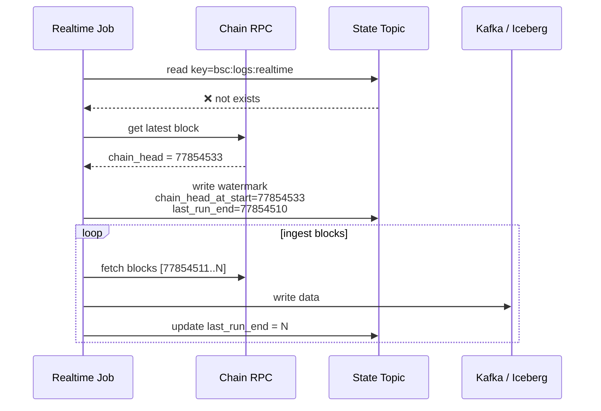
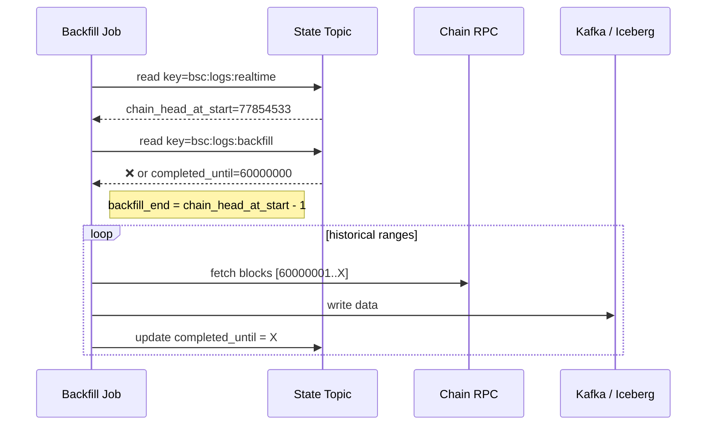
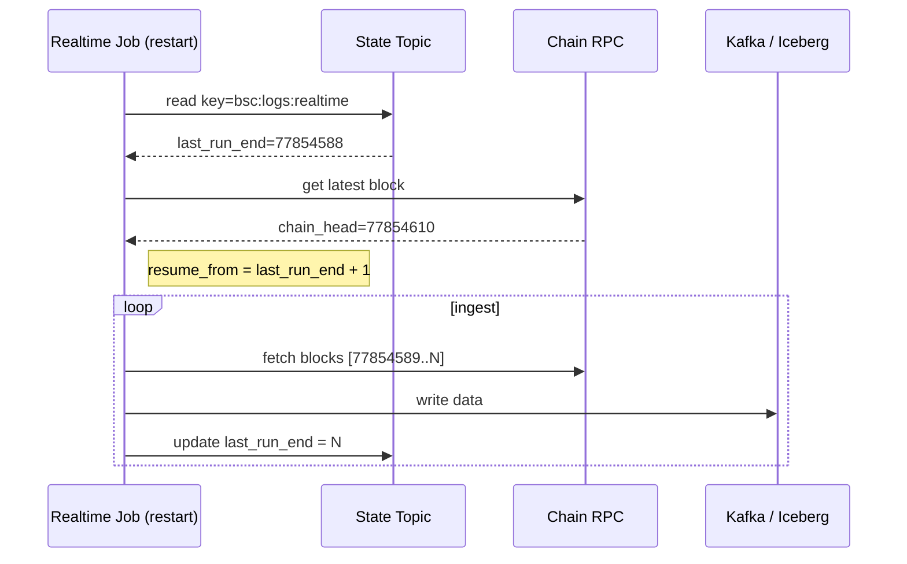
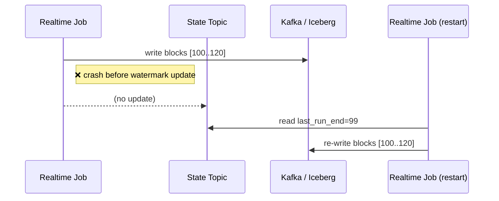
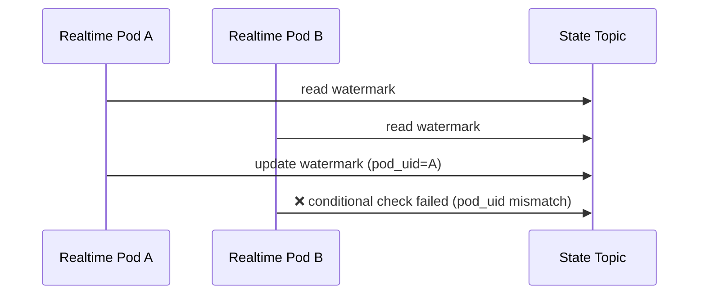

1️⃣ 正常启动：Realtime 首次启动

```mermaid
sequenceDiagram
    participant R as Realtime Job
    participant RPC as Chain RPC
    participant S as State Topic
    participant K as Kafka / Iceberg

    R->>S: read key=bsc:logs:realtime
    S-->>R: ❌ not exists

    R->>RPC: get latest block
    RPC-->>R: chain_head = 77854533

    R->>S: write watermark<br/>chain_head_at_start=77854533<br/>last_run_end=77854510

    loop ingest blocks
        R->>RPC: fetch blocks [77854511..N]
        R->>K: write data
        R->>S: update last_run_end = N
    end
```

2️⃣ Backfill 启动（依赖 Realtime 边界）

```mermaid
sequenceDiagram
    participant B as Backfill Job
    participant S as State Topic
    participant RPC as Chain RPC
    participant K as Kafka / Iceberg

    B->>S: read key=bsc:logs:realtime
    S-->>B: chain_head_at_start=77854533

    B->>S: read key=bsc:logs:backfill
    S-->>B: ❌ or completed_until=60000000

    Note right of B: backfill_end = chain_head_at_start - 1

    loop historical ranges
        B->>RPC: fetch blocks [60000001..X]
        B->>K: write data
        B->>S: update completed_until = X
    end
```

3️⃣ Realtime Job 重启（最常见 & 最容易出 bug）

```mermaid
sequenceDiagram
    participant R2 as Realtime Job (restart)
    participant S as State Topic
    participant RPC as Chain RPC
    participant K as Kafka / Iceberg

    R2->>S: read key=bsc:logs:realtime
    S-->>R2: last_run_end=77854588

    R2->>RPC: get latest block
    RPC-->>R2: chain_head=77854610

    Note right of R2: resume_from = last_run_end + 1

    loop ingest
        R2->>RPC: fetch blocks [77854589..N]
        R2->>K: write data
        R2->>S: update last_run_end = N
    end
```

4️⃣ ⚠️ 异常场景：Pod 写到一半被杀

```mermaid
sequenceDiagram
    participant R as Realtime Job
    participant S as State Topic
    participant K as Kafka / Iceberg

    R->>K: write blocks [100..120]
    Note right of R: ❌ crash before watermark update

    R-->>S: (no update)

    participant R2 as Realtime Job (restart)
    R2->>S: read last_run_end=99
    R2->>K: re-write blocks [100..120]
```

5️⃣ 多 Pod 同时启动（fencing 语义）

```mermaid
sequenceDiagram
    participant R1 as Realtime Pod A
    participant R2 as Realtime Pod B
    participant S as State Topic

    R1->>S: read watermark
    R2->>S: read watermark

    R1->>S: update watermark (pod_uid=A)
    R2->>S: ❌ conditional check failed (pod_uid mismatch)
```