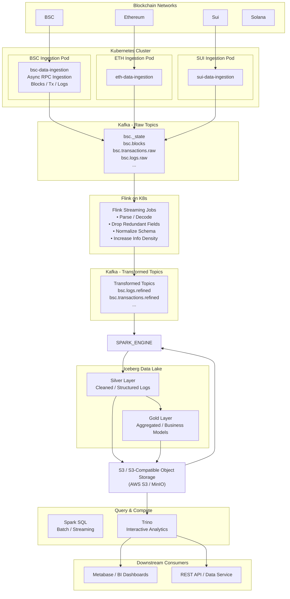

```mermaid
flowchart TD
    %% =====================
    %% Blockchain Networks
    %% =====================
    subgraph CHAINS["Blockchain Networks"]
        BSC["BSC"]
        ETH["Ethereum"]
        SUI["Sui"]
        SOLANA["Solana"]
    end

    %% =====================
    %% Kubernetes Ingestion Layer
    %% =====================
    subgraph K8S["Kubernetes Cluster"]
        direction TB

        subgraph BSC_INGEST["BSC Ingestion Pod"]
            BSC_LOGS["bsc-data-ingestion<br/>Async RPC Ingestion<br/>Blocks / Tx / Logs"]
        end

        subgraph ETH_INGEST["ETH Ingestion Pod"]
            ETH_LOGS["eth-data-ingestion"]
        end

        subgraph SUI_INGEST["SUI Ingestion Pod"]
            SUI_INGESTION["sui-data-ingestion"]
        end
    end

    %% =====================
    %% Kafka Layer
    %% =====================
    %% subgraph KAFKA["Kafka Cluster "]


        subgraph KAFKA_RAW_TOPICS["Kafka - Raw Topics"]
        RAW_TOPICS["bsc._state<br/>bsc.blocks<br/>bsc.transactions.raw<br/>bsc.logs.raw<br/>..."]
        end


        subgraph KAFKA_TRANS_TOPICS["Kafka - Transformed Topics "]

        TRANS_TOPICS["Transformed Topics<br/>bsc.logs.refined<br/>bsc.transactions.refined<br/>..."]
        end
    %% end

    %% =====================
    %% Flink Stream Processing
    %% =====================
    subgraph FLINK["Flink on K8s"]
        FLINK_JOB["Flink Streaming Jobs<br/>• Parse / Decode<br/>• Drop Redundant Fields<br/>• Normalize Schema<br/>• Increase Info Density"]
    end

    %% =====================
    %% Data Lake / Iceberg
    %% =====================
    subgraph DATALAKE["Iceberg Data Lake"]
        direction TB
        SILVER["Silver Layer<br/>Cleaned / Structured Logs"]
        GOLD["Gold Layer<br/>Aggregated / Business Models"]
    end

    %% =====================
    %% Object Storage
    %% =====================
    S3["S3 / S3-Compatible Object Storage<br/>(AWS S3 / MinIO)"]

    %% =====================
    %% Compute / Query
    %% =====================
    subgraph QUERY["Query & Compute"]
        SparkSQL/PySpark["Spark SQL<br/>Batch / Streaming"]
        TRINO["Trino<br/>Interactive Analytics"]
    end

    %% =====================
    %% Consumers
    %% =====================
    subgraph CONSUMERS["Downstream Consumers"]
        METABASE["Metabase / BI Dashboards"]
        API["REST API / Data Service"]
    end

    %% =====================
    %% Connections
    %% =====================
    BSC --> BSC_LOGS
    ETH --> ETH_LOGS
    SUI --> SUI_INGESTION
    BSC_LOGS --> RAW_TOPICS
    ETH_LOGS --> RAW_TOPICS
    SUI_INGESTION --> RAW_TOPICS
    RAW_TOPICS --> FLINK_JOB
    FLINK_JOB --> TRANS_TOPICS
    TRANS_TOPICS --> SPARK_ENGINE
    SPARK_ENGINE --> SILVER
    SILVER --> GOLD

    SILVER --> S3
    GOLD --> S3

    S3 --> TRINO
    S3 --> SPARK_ENGINE

    TRINO --> METABASE
    TRINO --> API

```