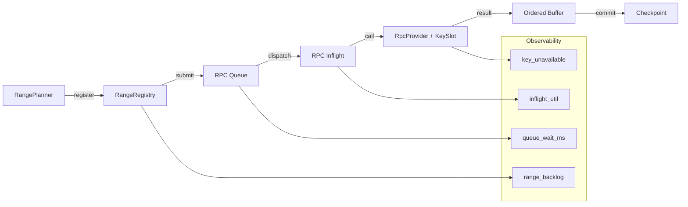

| 维度                            | 你现在看到          | 你缺的                  |
| ----------------------------- | -------------- | -------------------- |
| Time（key_interval）            | RPC 成功/失败      | **Key 被限流了多少次 / 多久** |
| Concurrency（rpc_max_inflight） | inflight 数     | **是否成为瓶颈**           |
| Queue（max_queue）              | queue size     | **是否经常顶满 / 等太久**     |
| Window（max_inflight_ranges）   | checkpoint lag | **range 是否长期积压**     |

