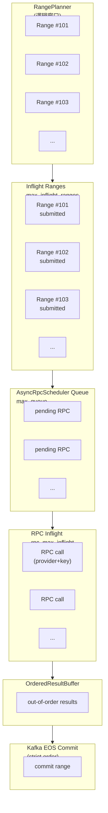
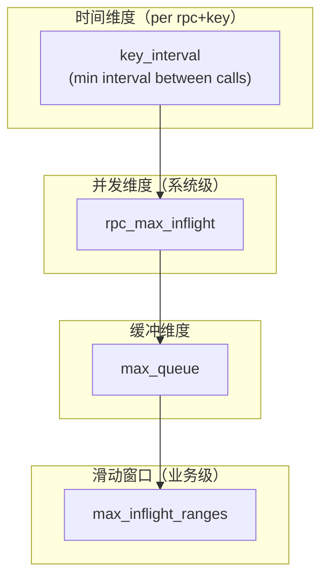

# Architecture




effective_qps
= Σ_over_keys (1 / key_interval)

max_inflight_ranges
≤ effective_qps × avg_range_rpc_time × safety_factor

safety_factor = 1.5 ~ 2

### 共同构成一个「三维限流系统：时间 × 并发 × 窗口」
| 参数                  | 建议                     | 职责 | 决定 |
| ------------------- | ---------------------- |--|-|
| weight              | 生成一个 provider 尝试顺序 | weight越大, 越先尝试这个provider | 「资源配额」|
| key_interval        | 严格按 provider policy    | 不控制“能不能排队”，只控制“能不能现在发” | 「你能不能发」 |
| rpc_max_inflight    | ≈ 可用 key 数 × 1         | 决定 RPC provider 的真实压力 | 「你能发多少个」 |
| max_queue           | rpc_max_inflight × 2~3 | 负责 吸收 RPC 抖动，防止上游雪崩 | 「发不了时能不能等」 | 
| max_inflight_ranges | rpc_max_inflight × 2   | 决定 系统整体吞吐上限 | 「系统能欠多少债」 |


| 参数                    | 控制的是               | 本质                   |
| --------------------- | ------------------ | -------------------- |
| max_inflight_ranges = 20 | 最多允许多少个 block range 同时处于“未完成状态” | 系统级「滑动窗口宽度」ingestion 的“全局水位线” |
| rpc_max_inflight = 10  | 同时最多允许多少个 RPC request 在“飞行中” | 这是系统真实的“外部并发” |
| max_queue = 30      | 吸收抖动，防止 planner / retry 把系统打爆 | 缓冲，backpressure(吸收抖动，防止 planner / retry 把系统打爆) |

- max_inflight_ranges ≈ 2 ~ 3 × rpc_max_inflight
- max_queue           ≈ 1 ~ 2 × max_inflight_ranges


```TXT
RangePlanner
   ↓ (max_inflight_ranges = 20)
submit_range()
   ↓
AsyncRpcScheduler
   ↓ (rpc_max_inflight = 10, queue = 30)
Web3AsyncRouter
   ↓
RPC(provider + key)   ← 最小并发粒度
   ↓
RPC 完成（乱序）
   ↓
OrderedResultBuffer
   ↓
严格顺序 pop_ready()
   ↓
Kafka EOS（同步事务）
   ↓
range committed → 才允许 planner 继续推进

```


max_inflight_ranges = 20
rpc_max_inflight = 10 
其中：
10 个：正在 RPC
~10 个：等待 RPC / 等待 OrderedBuffer 放行
👉 这是一个典型的「RPC 深度队列缓冲

