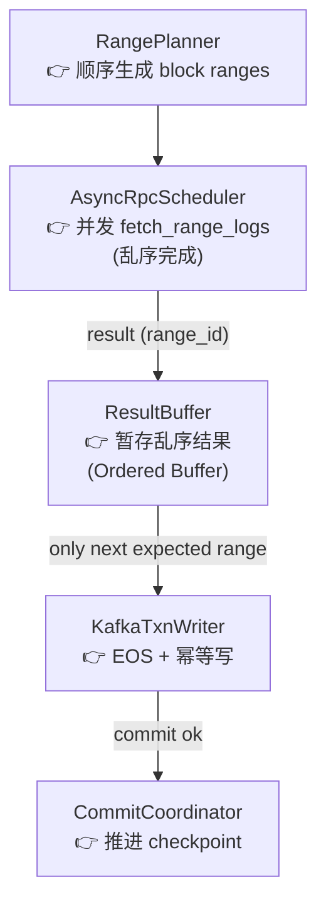

# Architecture



| 参数                    | 控制的是               | 本质                   |
| --------------------- | ------------------ | -------------------- |
| **max_submit** | submit 侧的 burst 大小 | *生产速率*               |
| **max_queue**         | 队列最大深度             | *缓冲区 / backpressure* |
| **max_inflight**      | 同时在飞的 RPC 数        | *真正并发度*              |
| **max_workers**       | dispatch 速度        | *调度线程数*              |


max_submit ≈ max_inflight ~ 3 × max_inflight
max_queue ≥ max_submit
max_queue ≈ 3~10 × max_inflight

max_safe_submit ≈ max_queue + max_inflight


```TXT
submit (max_submit)
   ↓
queue (max_queue)
   ↓
dispatcher (max_workers)
   ↓
executor (semaphore = max_inflight)
   ↓
RPC providers
```

