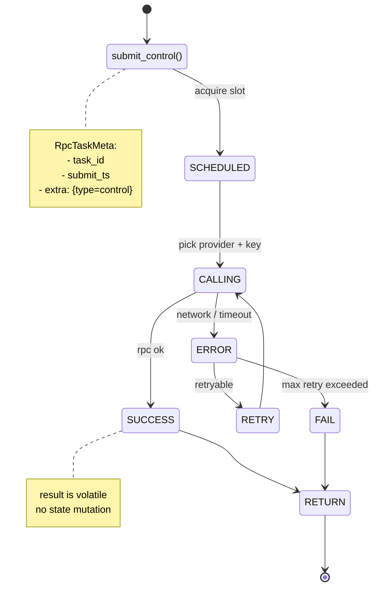
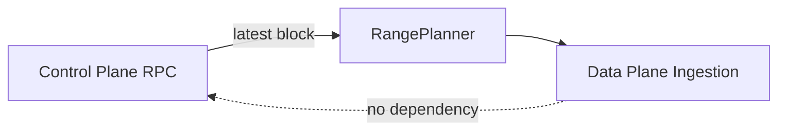

```mermaid
stateDiagram-v2
    [*] --> SUBMIT

    SUBMIT: submit_control()
    SUBMIT --> SCHEDULED: acquire slot

    SCHEDULED --> CALLING: pick provider + key
    CALLING --> SUCCESS: rpc ok
    CALLING --> ERROR: network / timeout

    ERROR --> RETRY: retryable
    RETRY --> CALLING

    ERROR --> FAIL: max retry exceeded

    SUCCESS --> RETURN
    FAIL --> RETURN

    RETURN --> [*]

    note right of SUBMIT
      RpcTaskMeta:
      - task_id
      - submit_ts
      - extra: {type=control}
    end note

    note right of SUCCESS
      result is volatile
      no state mutation
    end note

```

```mermaid
flowchart LR
    CP[Control Plane RPC] -->|latest block| PL[RangePlanner]
    PL --> DP[Data Plane Ingestion]

    DP -. no dependency .-> CP
```