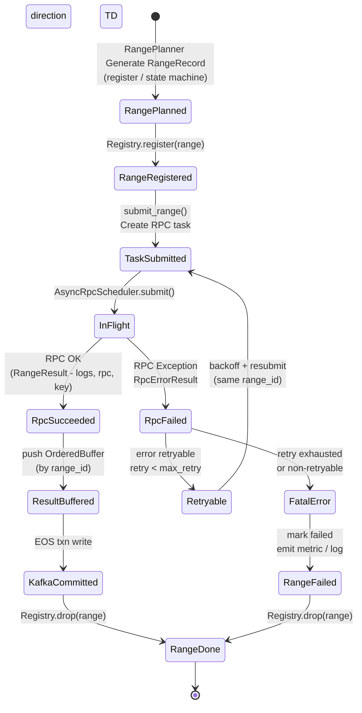

```mermaid
stateDiagram-v2
    direction TD

    %% ========================
    %% Range lifecycle
    %% ========================
    [*] --> 
    
    RangePlanned : RangePlanner <br/> Generate RangeRecord (register / state machine)

    RangePlanned --> RangeRegistered : Registry.register(range)
    
    RangeRegistered --> TaskSubmitted : submit_range()<br/>Create RPC task
    TaskSubmitted --> InFlight : AsyncRpcScheduler.submit()

    %% ========================
    %% RPC execution
    %% ========================
    InFlight --> RpcSucceeded : RPC OK<br/>(RangeResult - logs, rpc, key)
    InFlight --> RpcFailed : RPC Exception<br/>RpcErrorResult

    %% ========================
    %% Success path
    %% ========================
    RpcSucceeded --> ResultBuffered : push OrderedBuffer<br/>(by range_id)
    ResultBuffered --> KafkaCommitted : EOS txn write
    KafkaCommitted --> RangeDone : Registry.drop(range)

    %% ========================
    %% Retry path
    %% ========================
    RpcFailed --> Retryable : error retryable<br/>retry < max_retry
    Retryable --> TaskSubmitted : backoff + resubmit<br/>(same range_id)

    RpcFailed --> FatalError : retry exhausted<br/>or non-retryable

    FatalError --> RangeFailed : mark failed<br/>emit metric / log
    RangeFailed --> RangeDone : Registry.drop(range)

    %% ========================
    %% Terminal
    %% ========================
    RangeDone --> [*]

```